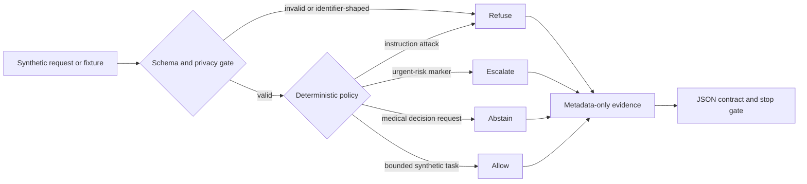

<div align="center">

[](https://python.org)
[](tests/)
[](https://www.kaggle.com/code/ajinkya1225/project-11-medllm-safety-synthetic-validation)
[](#what-this-actually-is)
[](LICENSE)

</div>

<div align="center">

[Overview](#what-this-actually-is) ·
[Architecture](#architecture) ·
[Results](#verified-status) ·
[Kaggle](#kaggle-synthetic-validation) ·
[Bugs](#bugs-that-cost-time) ·
[Install](#install) ·
[Reproducibility](#reproducibility) ·
[Security](#security-and-privacy) ·
[Limitations](#limitations-and-roadmap) ·
[Citation](#citation)

</div>

> **Release scope.** Synthetic-only safety-engineering artifact. No patient data, no medical-model inference, no provider or API calls, no clinical validation. Public evidence: 63 export tests passing with 0 restricted artifacts, plus a completed Kaggle CPU run (59 tests passing, now public — see [Kaggle synthetic validation](#kaggle-synthetic-validation)). This is not a clinical or production system.

## What This Actually Is

**Synthetic-only · provider-free · CPU-validated locally · clinically unvalidated**

MedLLM Safety is a compact, fail-closed reference implementation for testing medical-language-model safety contracts without using a medical model, patient data, or external provider.

It addresses a common evaluation failure: safety plumbing, refusal behavior, provenance, and statistical reporting are often trusted before their own contracts are tested. This repository makes those boundaries executable with deterministic synthetic fixtures. It is intended for AI-assurance engineers, evaluation researchers, security reviewers, and portfolio reviewers — not clinicians or patients.

**What is implemented:**

- Deterministic `allow`, `refuse`, `abstain`, and `escalate` decisions for synthetic requests.
- Prompt-injection and high-risk instruction boundaries.
- PHI-shaped marker detection, deterministic redaction, and metadata-only logging.
- Strict benchmark, matched-vignette, model-capability, fallback, evidence, and report schemas.
- Factual benchmark accuracy and exploratory synthetic response-drift contracts.
- A bounded exact paired sign test, multiplicity correction, effect metadata, and a distribution-free interval.
- A source-only Kaggle notebook that runs without internet, GPU, datasets, models, or providers.

## Architecture



Static fallback: every synthetic input first passes schema/privacy validation, then a deterministic policy selects allow, refuse, abstain, or escalate; only metadata — not prompt text — is written to evidence before execution stops.

### Safety contracts and invariants

- `synthetic=True` is mandatory; non-synthetic input fails closed.
- Request IDs are bounded and cannot contain free-form patient identifiers.
- Decisions never echo input text.
- Safe log events omit request IDs, prompts, and responses.
- Requested and actual model identities cannot differ unless fallback is explicit and non-comparable.
- An encoder/classifier is never presented as an autoregressive generator.
- Benchmark error is called factual inaccuracy, not hallucination, unless a separate validated rubric exists.
- Demographic fixtures are exploratory matched-vignette response drift — not population or causal fairness evidence.
- Provider/API usage is `none`; model inference is `not_run`.

### Refusal, abstention, and escalation

| Decision | Synthetic trigger | Behavior |
|---|---|---|
| Allow | Bounded evaluation request | Permits only the synthetic workflow. |
| Refuse | Instruction attack or identifier-shaped text | Blocks the request without echoing it. |
| Abstain | Diagnosis, prescription, dosing, or treatment-plan request | Declines medical decision support and directs real decisions to qualified clinicians. |
| Escalate | Emergency-shaped or self-harm language | Produces a generic urgent human-review message; it does not assess or diagnose. |

These rules are deliberately small and testable. They are not a substitute for a validated production policy or human clinical review.

## Verified status

| Dimension | Status |
|---|---|
| Safety contracts | Implemented |
| Source-workspace tests | Locally tested: 65 passed (2026-09-12) |
| Public-export test | Locally tested: 63 passed; restricted artifacts: 0 |
| Kaggle synthetic validation | Public CPU run (v2): 59 passed; evidence exit `0` |
| Input scope | Synthetic only |
| Provider/model execution | Not run |
| Clinical validation | Not performed |
| Public release | Public GitHub artifact; not a clinical or production release |

Test counts differ by scope on purpose: the source workspace carries two documentation-regression tests that are not part of the frozen public-export or Kaggle snapshots. See [Bugs That Cost Time](#bugs-that-cost-time) for why that distinction exists.

## Kaggle synthetic validation

The root `kernel-metadata.json` configures the kernel `ajinkya1225/project-11-medllm-safety-synthetic-validation` with internet and GPU disabled and no attached sources. The notebook contains a hashed source archive because the Kaggle kernel API uploads the declared notebook code file rather than a general repository tree.

```console
kaggle kernels push -p .
kaggle kernels status ajinkya1225/project-11-medllm-safety-synthetic-validation
kaggle kernels logs ajinkya1225/project-11-medllm-safety-synthetic-validation
kaggle kernels output ajinkya1225/project-11-medllm-safety-synthetic-validation -p ../medllm-safety-kaggle-output
```

Use the bounded polling and failure rules in [the Kaggle runbook](docs/KAGGLE_RUNBOOK.md). No dataset or model source is attached.

Kaggle normalized the requested metadata id `ajinkya1225/11-medllm-safety-synthetic-validation` to the canonical remote slug `project-11-medllm-safety-synthetic-validation` when it first created the kernel; the metadata file now uses that canonical slug directly.

| Version | Visibility | Outcome | Detail |
|---|---|---|---|
| v1 | Private | ✅ Complete | 59/59 tests passed, exit code `0`, Python 3.12.13, pytest 8.4.2, CPU, seed `17`, 4 synthetic policy samples, 0 restricted artifacts. Emitted a `MissingIDFieldWarning` (see [Bugs That Cost Time](#bugs-that-cost-time)). |
| v2 | Public | ✅ Complete | Re-run after flipping the kernel public for this release. 59/59 tests passed, exit code `0`, same environment and seed, same embedded source-archive hash. No `MissingIDFieldWarning` this time — cell IDs were already fixed. |

**Live notebook:** [kaggle.com/code/ajinkya1225/project-11-medllm-safety-synthetic-validation](https://www.kaggle.com/code/ajinkya1225/project-11-medllm-safety-synthetic-validation)

Both runs emitted two environment `SyntaxWarning`s from Kaggle's own `mistune`/`nbconvert` notebook-conversion packages; these are dependency warnings from Kaggle's environment, not from this project's code, and do not affect the test result.

## Bugs That Cost Time

Real issues hit while building this, kept here because failed attempts are part of the evidence trail.

**1. Fisher's exact test applied to the wrong table shape.**
`scipy.stats.fisher_exact` is a 2×2 test; the demographic-drift analysis produces a 5×3 contingency table. Caught during evaluator design, before any inferential test ran on real fixtures. Fix: replaced it with a table-shape-aware exact/permutation method and added a contract test that asserts table shape before any statistical test executes.

**2. Kaggle silently renamed the kernel slug.**
`kernel-metadata.json` requested `ajinkya1225/11-medllm-safety-synthetic-validation`, but Kaggle normalized the URL to `project-11-medllm-safety-synthetic-validation` on first creation. Every later `status`/`push` call had to target the canonical slug — using the requested id returned a 404, and re-pushing under the old id later returned a `409 Conflict` ("kernel title does not resolve to the specified id"). Fix: updated the metadata file to the canonical slug directly.

**3. Missing notebook cell IDs.**
The first Kaggle run (v1) completed but emitted `MissingIDFieldWarning` — nbformat's stable-cell-ID requirement, due to become a hard error in a future version. Fix: generated a stable `id` for every notebook cell and added a regression test asserting none are empty; v2 ran clean with no such warning.

**4. Stray `.pyc` files failed the restricted-artifact gate.**
The public-export validator imported project modules before redirecting subprocess caches, which silently wrote six `.pyc` files into the export tree — correctly caught by the zero-restricted-artifact check. The same run also lost pytest's pass-count summary because `-q` was set both on the command line and in `pyproject.toml`. Fix: set `sys.dont_write_bytecode` before import, disabled pytest's cache plugin, redirected subprocess bytecode, and removed the duplicate `-q`.

**5. `Path.GetRelativePath` doesn't exist in Windows PowerShell's .NET runtime.**
The first public-export script used `[System.IO.Path]::GetRelativePath` and failed with repeated non-terminating errors mid-copy, leaving a partial export tree. Fix: switched to a path operation supported by the active PowerShell runtime and added a post-copy file-inventory check before trusting any export.

**6. Test counts drifted across source, export, and Kaggle scopes.**
Adding two documentation-regression tests raised the source-workspace suite from 63 to 65 tests, but the already-published export and the already-completed Kaggle run correctly kept their original, immutable counts. Fix: report all three counts separately (see [Verified status](#verified-status)) instead of a single number that silently goes stale.

## Install

Python 3.11 or newer is required. Runtime code uses only the standard library. Tests use the pinned development dependency.

```console
python -m venv .venv
.venv\Scripts\activate
python -m pip install -e ".[test]"
```

Dependency installation is a user-controlled step. The validation scripts never install packages.

### Local verification

```console
python -m compileall -q medllm_safety project_preflight tests scripts run_synthetic_validation.py run_audit.py
python -m pytest -q
python run_synthetic_validation.py --source-root . --output ../medllm-safety-evidence/local-synthetic-validation.json --evidence-path local-synthetic-validation.json
```

Fresh source-workspace result on 2026-09-12: **65 tests passed**, pytest exit code `0`, compileall exit code `0`, with no warnings reported. The public-export command passed 63 tests with exit code `0` and zero restricted artifacts.

## Design Contracts

- Every request is validated against a strict schema before any policy decision runs.
- `synthetic=True` is enforced at the boundary, not inferred downstream.
- Report renderers (JSON/HTML) share one contract; nothing bypasses it to render partial or unvalidated output.
- Paired statistical comparisons require one row per matched scenario before analysis runs.
- Fallback model results are logged and excluded from independent model-comparison claims — never silently substituted.
- Approval records default to `Status: not requested` and `Ready for external access: no` until a human explicitly approves a concrete target.

## Reproducibility

<details>
<summary>Exact artifact hashes and environment versions (click to expand)</summary>

| Artifact | Value |
|---|---|
| Kaggle v1/v2 embedded source-archive (SHA-256) | `cd0c46ad8fab08736d3a62683271c96243c157987fa8aeee64db4f6f7027114b` (unchanged between versions — only kernel visibility changed) |
| Kaggle v2 configuration hash | `sha256:e100f995d9204bcacb68bca4fff429ad38893f2f1f3364b1166c00794491331c` |
| Kaggle v2 source-tree revision | `tree-sha256:437b8c77c680ca493855312467b1269cb729fb2a5f576a3b315461a49a91ba7a` |
| Kaggle run environment | Python 3.12.13, pytest 8.4.2, CPU, seed `17` |
| Local source-workspace run (2026-09-12) | 65 passed, pytest exit `0`, compileall exit `0` |
| Test dependency | `pytest==9.0.3` (local verified run); Kaggle records its own installed version above |

</details>

- Seed: `17`.
- Runtime dependencies: none.
- Evidence includes a canonical configuration hash and source-tree SHA-256 revision on every run.
- Compile and test subprocesses have a 120-second bound and redirect caches outside the source tree.
- Every validation run records provider use as `none`, model inference as `not_run`, and device as `cpu`.

## Security and Privacy

Only synthetic fixture text is allowed. Do not add patient records, clinical notes, medical identifiers, provider responses, secrets, `.env` files, model weights, checkpoints, datasets, or generated evaluation outputs. Redaction is defense in depth — not authorization to process real PHI. See [SECURITY.md](SECURITY.md) for safe reporting guidance.

The repository makes no claim of HIPAA, GDPR, medical-device, regulatory, diagnostic, efficacy, fairness, deployment, or real-world safety compliance.

## Limitations and roadmap

Current evidence validates software contracts against synthetic fixtures only. It does not establish medical-model quality, clinical safety, fairness, diagnostic performance, provider behavior, or deployment readiness.

Future work remains blocked on separately approved and reviewed model/data revisions, licenses, checksums, remote-code policy, privacy review, human evaluation protocol, compute budget, and claim review. Any future model run must remain a distinct evidence phase and must never overwrite the synthetic-only status recorded here.

## Related Work

| Work | Relevance to this repository |
|---|---|
| Jin et al., "What Disease Does This Patient Have?" (MedQA), 2020 | Source of the factual-benchmark question format this repo's accuracy evaluator contracts are built around. |
| Singhal et al., "Large Language Models Encode Clinical Knowledge" (Med-PaLM), Nature, 2023 | Motivates the contractual distinction this repo enforces between benchmark accuracy and clinical safety claims. |
| Perez et al., "Red Teaming Language Models with Language Models", 2022 | Motivates the prompt-injection and instruction-attack refusal boundary tested here. |

## Citation

Use the repository title, exact release tag or commit, repository URL, and access date. No contributor or authorship identity is asserted beyond GitHub's verified repository metadata. A copy-ready template is also in [CITATION.md](CITATION.md).

```bibtex
@misc{awari2026medllmsafety,
  author       = {Awari, Ajinkya},
  title        = {MedLLM Safety: Synthetic-Only Safety Contracts for Medical-Language-Model Evaluation},
  year         = {2026},
  howpublished = {\url{https://github.com/ajinkya-awari/medllm-safety}},
  note         = {Synthetic safety-engineering artifact; not a clinically validated system.}
}
```

This citation refers to a synthetic safety-engineering artifact. It must not be described as a clinically validated medical system. No third-party source is vendored; development dependency notices are in [THIRD_PARTY_NOTICES.md](THIRD_PARTY_NOTICES.md).

## Attribution

Sole author: **Ajinkya Awari** ([@ajinkya-awari](https://github.com/ajinkya-awari)).

## License

Licensed under the [Apache License 2.0](LICENSE). No ownership identity is invented in this repository.


