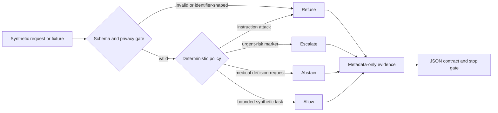

# MedLLM Safety

**Synthetic-only · provider-free · CPU-validated locally · clinically unvalidated**

MedLLM Safety is a compact, fail-closed reference implementation for testing medical-language-model safety contracts without using a medical model, patient data, or external provider.

It addresses a common evaluation failure: safety plumbing, refusal behavior, provenance, and statistical reporting are often trusted before their own contracts are tested. This repository makes those boundaries executable with deterministic synthetic fixtures. It is intended for AI-assurance engineers, evaluation researchers, security reviewers, and portfolio reviewers—not clinicians or patients.

## What is implemented

- Deterministic `allow`, `refuse`, `abstain`, and `escalate` decisions for synthetic requests.
- Prompt-injection and high-risk instruction boundaries.
- PHI-shaped marker detection, deterministic redaction, and metadata-only logging.
- Strict benchmark, matched-vignette, model-capability, fallback, evidence, and report schemas.
- Factual benchmark accuracy and exploratory synthetic response-drift contracts.
- A bounded exact paired sign test, multiplicity correction, effect metadata, and a distribution-free interval.
- A source-only Kaggle notebook that runs without internet, GPU, datasets, models, or providers.

## Architecture



Static fallback: every synthetic input first passes schema/privacy validation, then a deterministic policy selects allow, refuse, abstain, or escalate; only metadata—not prompt text—is written to evidence before execution stops.

## Safety contracts and invariants

- `synthetic=True` is mandatory; non-synthetic input fails closed.
- Request IDs are bounded and cannot contain free-form patient identifiers.
- Decisions never echo input text.
- Safe log events omit request IDs, prompts, and responses.
- Requested and actual model identities cannot differ unless fallback is explicit and non-comparable.
- An encoder/classifier is never presented as an autoregressive generator.
- Benchmark error is called factual inaccuracy, not hallucination, unless a separate validated rubric exists.
- Demographic fixtures are exploratory matched-vignette response drift—not population or causal fairness evidence.
- Provider/API usage is `none`; model inference is `not_run`.

## Refusal, abstention, and escalation

| Decision | Synthetic trigger | Behavior |
|---|---|---|
| Allow | Bounded evaluation request | Permits only the synthetic workflow. |
| Refuse | Instruction attack or identifier-shaped text | Blocks the request without echoing it. |
| Abstain | Diagnosis, prescription, dosing, or treatment-plan request | Declines medical decision support and directs real decisions to qualified clinicians. |
| Escalate | Emergency-shaped or self-harm language | Produces a generic urgent human-review message; it does not assess or diagnose. |

These rules are deliberately small and testable. They are not a substitute for a validated production policy or human clinical review.

## Install

Python 3.11 or newer is required. Runtime code uses only the standard library. Tests use the pinned development dependency.

```console
python -m venv .venv
.venv\Scripts\activate
python -m pip install -e ".[test]"
```

Dependency installation is a user-controlled step. The validation scripts never install packages.

## Local verification

```console
python -m compileall -q medllm_safety project_preflight tests scripts run_synthetic_validation.py run_audit.py
python -m pytest -q
python run_synthetic_validation.py --source-root . --output ../medllm-safety-evidence/local-synthetic-validation.json --evidence-path local-synthetic-validation.json
```

Fresh source-workspace result on 2026-09-11: **63 tests passed**, pytest exit code `0`, compileall exit code `0`, with no warnings reported. The public-export command passed the same 63 tests with exit code `0` and zero restricted artifacts. The Kaggle result is recorded only after its separate run completes.

## Kaggle synthetic validation

The root `kernel-metadata.json` configures the private kernel `ajinkya1225/11-medllm-safety-synthetic-validation` with internet and GPU disabled and no attached sources. The notebook contains a hashed source archive because the Kaggle kernel API uploads the declared notebook code file rather than a general repository tree.

```console
kaggle kernels push -p .
kaggle kernels status ajinkya1225/project-11-medllm-safety-synthetic-validation
kaggle kernels logs ajinkya1225/project-11-medllm-safety-synthetic-validation
kaggle kernels output ajinkya1225/project-11-medllm-safety-synthetic-validation -p ../medllm-safety-kaggle-output
```

Use the bounded polling and failure rules in [the Kaggle runbook](docs/KAGGLE_RUNBOOK.md). No dataset or model source is attached.

Kaggle normalized the required metadata title to the canonical remote slug `project-11-medllm-safety-synthetic-validation` when it created the private kernel. The local metadata retains the requested ID. Kernel version 1 completed on 2026-09-11 with **59 tests passed**, compile exit code `0`, evidence exit code `0`, Python 3.12.13, pytest 8.4.2, CPU, seed 17, four synthetic policy samples, zero restricted artifacts, no provider/API use, and no model inference.

The run emitted a missing-cell-ID warning and two environment `SyntaxWarning`s from Kaggle's notebook conversion packages. Cell IDs were added afterward without changing the embedded source archive hash (`cd0c46ad8fab08736d3a62683271c96243c157987fa8aeee64db4f6f7027114b`); the environment warnings do not affect the test result.

## Verified status

| Dimension | Status |
|---|---|
| Safety contracts | Implemented |
| Source-workspace tests | Locally tested: 63 passed |
| Public-export test | Locally tested: 63 passed; restricted artifacts: 0 |
| Kaggle synthetic validation | Private CPU run: 59 passed; evidence exit 0 |
| Input scope | Synthetic only |
| Provider/model execution | Not run |
| Clinical validation | Not performed |
| Public release | Public GitHub artifact; not a clinical or production release |

## Privacy and security boundaries

Only synthetic fixture text is allowed. Do not add patient records, clinical notes, medical identifiers, provider responses, secrets, `.env` files, model weights, checkpoints, datasets, or generated evaluation outputs. Redaction is defense in depth—not authorization to process real PHI. See [SECURITY.md](SECURITY.md) for safe reporting guidance.

The repository makes no claim of HIPAA, GDPR, medical-device, regulatory, diagnostic, efficacy, fairness, deployment, or real-world safety compliance.

## Reproducibility

- Seed: `17`.
- Runtime dependencies: none.
- Test dependency: `pytest==9.0.3` for the verified local run; Kaggle records its actual installed version.
- Evidence includes a canonical configuration hash and source-tree SHA-256 revision.
- Compile and test subprocesses have a 120-second bound and redirect caches outside the source tree.
- Every validation run records provider use as `none`, model inference as `not_run`, and device as `cpu`.

## Citation and attribution

Use the repository URL, release tag or commit, and access date. A copy-ready template is in [CITATION.md](CITATION.md). No third-party source is vendored; development dependency notices are in [THIRD_PARTY_NOTICES.md](THIRD_PARTY_NOTICES.md).

## Limitations and roadmap

Current evidence validates software contracts against synthetic fixtures only. It does not establish medical-model quality, clinical safety, fairness, diagnostic performance, provider behavior, or deployment readiness.

Future work remains blocked on separately approved and reviewed model/data revisions, licenses, checksums, remote-code policy, privacy review, human evaluation protocol, compute budget, and claim review. Any future model run must remain a distinct evidence phase and must never overwrite the synthetic-only status recorded here.

## License

Licensed under the [Apache License 2.0](LICENSE). No ownership identity is invented in this repository.
